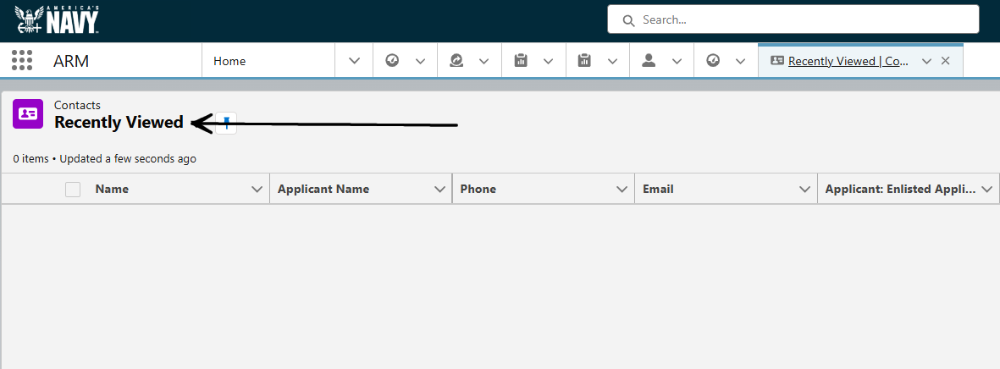

</img>
 

Being able to send a mass email to a lot of applicants is extremely useful. E-talent is hella busy loading up SF with applicants. You could look today and there are 200, and tomorrow there are 100 new ones.

It can start to get overwhelming when you don't know how best to reach them. Then leadership says, "Hey, we have 1.7k no-activity-leads that we need to get cleared out."

You: "Ok, how do I do that?"

<!-- more -->

 This isn't hard at all. It just isn't obvious on how to do it. I mean, why would there be a button that takes you right to it? That's too easy!

## Let's Get Started

(:material-lightbulb-on: *If necessary, images on this page will be blurred to some degree for privacy concerns. You can right click and `open image in new tab` to see it larger*)

### Step 1

After logging in to SF, you will be presented with this page. 

### Step 2

Once you are logged in and at the Main Page... you want to click on the ARM App Launcher.

### Step 3

Search using the word `contacts` in the box. Click on `Contacts`

### Step 4

Once you click Contacts, you will always be taken to the `Recently Viewed` page. Yours may look different than the screenshot, but it will always be `Recently Viewed`.(1) 
{ .annotate }

1. In the future when you have some lists saved, you can click the drop-down button next to `Recently Viewed` and choose your saved list.

### Step 5

We are going to create our own list. (1) Click on the gear icon and select `New`.
{ .annotate }

1. Again, in the future after you make a list or two, you will be able to select one of your own previously made lists. Instead of creating a new one.

Name your new list whatever you want.

### Step 6

Now we are brought into the list with a default filter of `Filter by Owner: My Contacts`. It is not immediately clear, to me, how this filter is applied to contacts. You may have a lot and you may have a little. I don't ever user this default filter.

### Step 7

We are going to click on the `Filter by Owner` box and change it to `All Contacts`.

### Step 8

:material-tooltip-remove-outline: Do not hit save yet.

???+ warning "Large List Email"

    Once you change it to `All Contacts` and click save. The list is going to be **VERY** large. DO NOT EMAIL THIS LIST!!

Now we want to apply filters to start dwindling down this list to something manageable. I suggest you don't email a list that is larger than 100 people. 